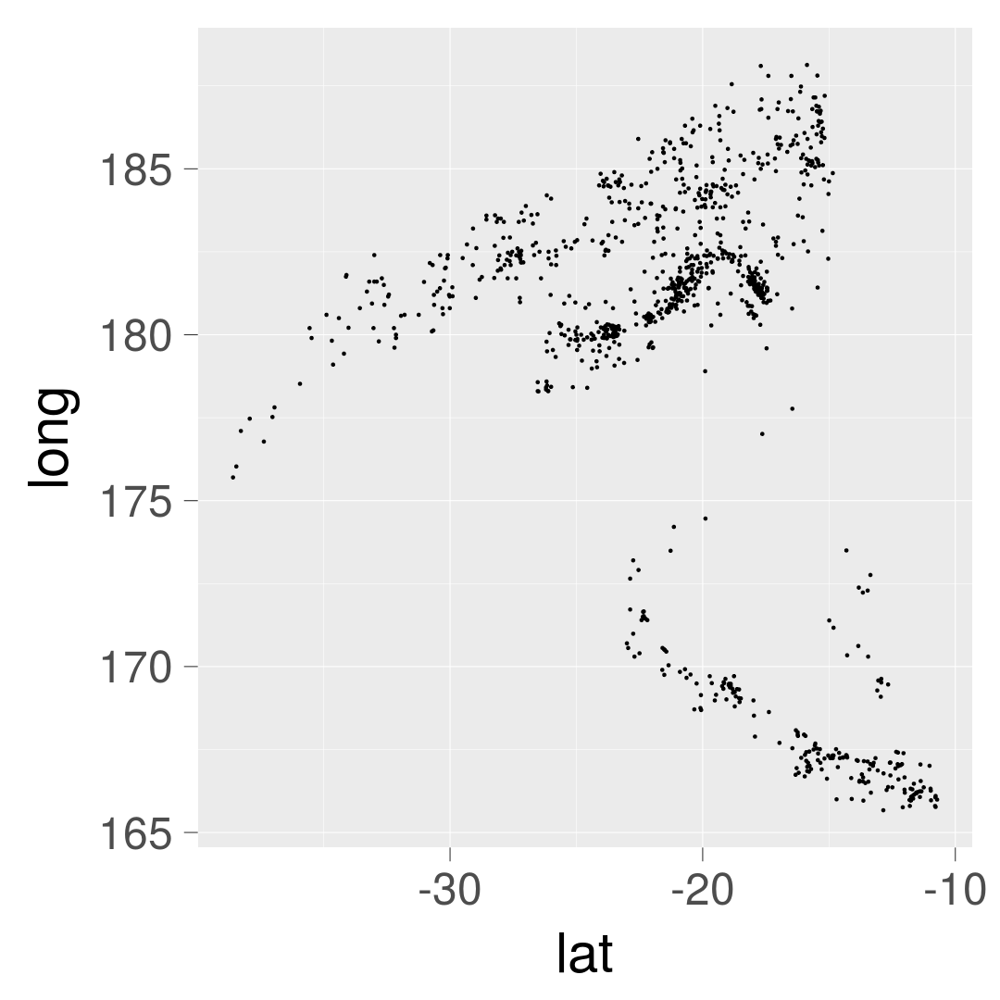
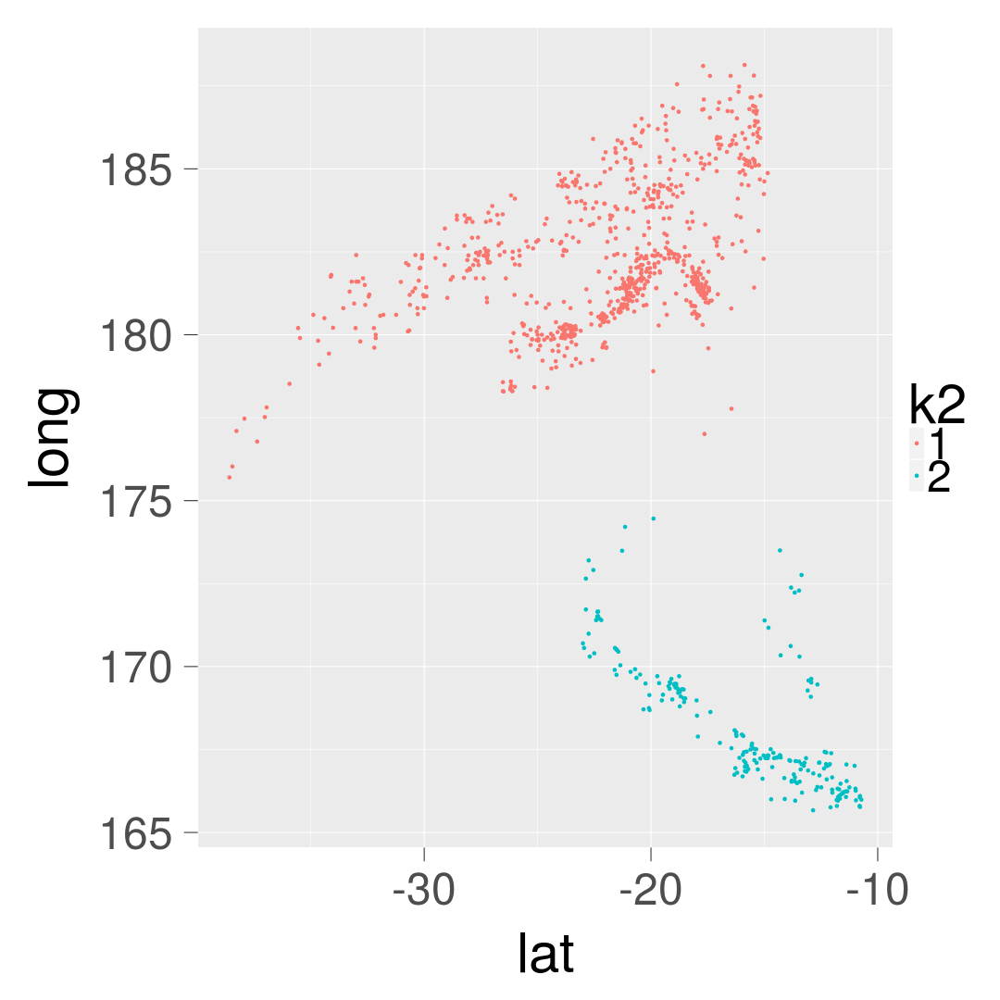
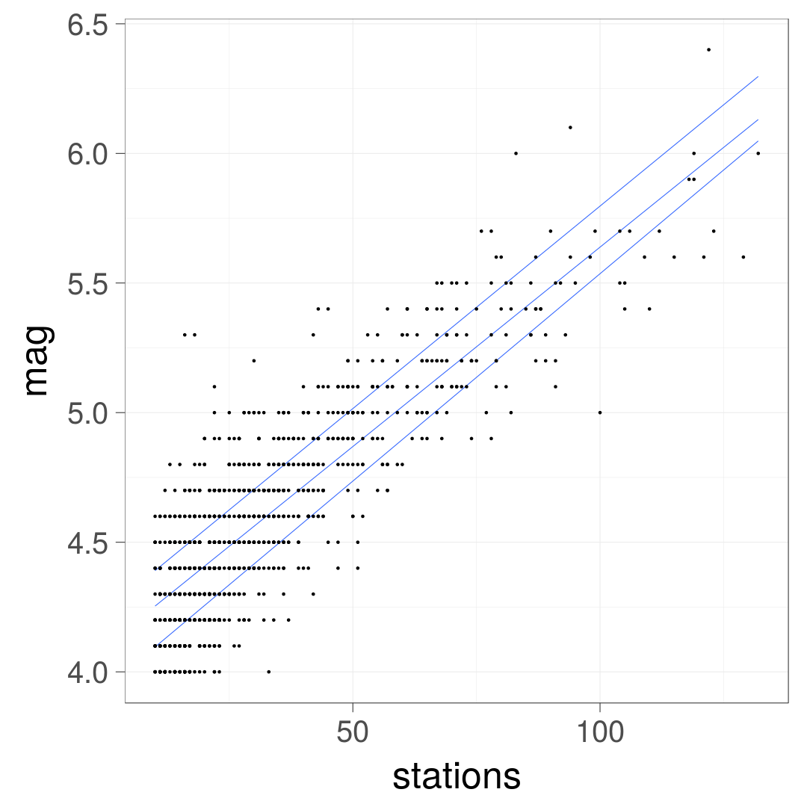

ggplot2 (for the brave and true)
========================================================
width: 1920
height: 1280
author: Daniel Moyer
date: 8/1/31
autosize: true

Presentation Objectives
========================================================

`ggplot2` is a package from [Hadley Wickham](http://hadley.nz/).

- Implements [the Grammar of Graphics](https://www.amazon.com/Grammar-Graphics-Statistics-Computing/dp/0387245448/ref=as_li_ss_tl?ie=UTF8&qid=1477928463&sr=8-1&keywords=the+grammar+of+graphics&linkCode=sl1&tag=ggplot2-20&linkId=f0130e557161b83fbe97ba0e9175c431), by Leland Wilkinson.
- Makes nice plots (...and that's what we all wanted right?)
- Related to some useful data-reshaping packages.

In other news:

- This is my first time using Rpres, which are markdown slides. I don't really have full control over them yet.
- All the figures here are generated in the same code as the slides themselves.
- You can find them [here in this git repo](https://github.com/dcmoyer/igc_ggplot_tutorial).
- Or you can clone it yourself using:

```bash
    git clone https://github.com/dcmoyer/igc_ggplot_tutorial
```
The Grammar of Graphics
========================================================

>"The grammar of graphics takes us beyond a limited set of charts (words) to an almost unlimited world of graphical forms (statements)." 
>
>    -Leland Wilkinson, Chapter 1, The Grammar of Graphics

<br />
- `ggplot2` is Object Oriented, with a plot object manipulated by member functions
- Corollary: Usually viewport agnostic (doesn't need a screen to make a plot!)
- It is imperfect.
- NO SURFACES =`(

Why code your plots?
=======================================================
>The strongest tool in science today is Ctrl-C + Ctrl-V.
>
> -Hadley Wickham, paraphrased

<br />

>The most useful tool in science tomorrow is git reset, followed by Ctrl-Z.
>
> -Probably Future Me

***


Data to play with
========================================================


```r
summary(quakes)
```

```
      lat              long           depth            mag      
 Min.   :-38.59   Min.   :165.7   Min.   : 40.0   Min.   :4.00  
 1st Qu.:-23.47   1st Qu.:179.6   1st Qu.: 99.0   1st Qu.:4.30  
 Median :-20.30   Median :181.4   Median :247.0   Median :4.60  
 Mean   :-20.64   Mean   :179.5   Mean   :311.4   Mean   :4.62  
 3rd Qu.:-17.64   3rd Qu.:183.2   3rd Qu.:543.0   3rd Qu.:4.90  
 Max.   :-10.72   Max.   :188.1   Max.   :680.0   Max.   :6.40  
    stations     
 Min.   : 10.00  
 1st Qu.: 18.00  
 Median : 27.00  
 Mean   : 33.42  
 3rd Qu.: 42.00  
 Max.   :132.00  
```

Easy summary of the data (not ggplot)
========================================================
left: 40%


```r
pairs(quakes)
```

***


Adding a few columns to quakes
========================================================

```r
#library(readr)
#df_fab <- read_csv("my_repo/my_example.csv")
quakes_df <- quakes

km_output <- kmeans(quakes[,c("lat","long")], centers = 2)
quakes_df$k2 <- factor(km_output[["cluster"]])

random_labels <- sample(1:4,nrow(quakes_df), replace=TRUE)
quakes_df$rand_label <- factor(random_labels)

km_output <- kmeans(quakes[,c("lat","long","depth")], centers = 4)
quakes_df$kd <- factor(km_output[["cluster"]])
```

Adding a few columns to quakes
========================================================

```r
head(quakes_df)
```

```
     lat   long depth mag stations k2 rand_label kd
1 -20.42 181.62   562 4.8       41  2          2  3
2 -20.62 181.03   650 4.2       15  2          1  3
3 -26.00 184.10    42 5.4       43  2          1  1
4 -17.97 181.66   626 4.1       19  2          1  3
5 -20.42 181.96   649 4.0       11  2          1  3
6 -19.68 184.31   195 4.0       12  2          1  2
```


Scatter plots
========================================================
left: 50%


```r
#
#installing things
install.packages("ggplot2")
library(ggplot2)

#
# making a plot?
p <- ggplot(data=quakes_df)
p
```

***


Scatter plots: Aesthetics
========================================================
left: 50%


```r
#
# making a plot?
p <- ggplot(
    data=quakes_df,
    mapping=aes(x=long,y=lat) # aes!
  ) 
p
```

***


Scatter plots: Finally a plot! (geom_point)
========================================================
left: 50%


```r
#
# making a plot
p <- ggplot(
    data=quakes_df,
    mapping=aes(x=long,y=lat)
  ) +
  geom_point() # geom!
p
```

***


Scatter plots: Messing With Text Size ("theme")
========================================================
left: 50%


```r
#
# making a plot
p <- ggplot(
    data=quakes_df,
    mapping=aes(x=long,y=lat)
  ) +
  geom_point() +
  theme_grey(base_size=60) # theme!
p
```

***



Scatter plots: Color
========================================================
left: 50%


```r
#
# making a plot
p <- ggplot(
    data=quakes_df, 
    mapping=aes(
      x=long,
      y=lat,
      color=k2) # added color
    ) +
  geom_point() +
  theme_grey(base_size=60)
p
```

***


Scatter plots: Messing with the little stuff
========================================================
left: 50%


```r
p <- ggplot(
    data=quakes_df,
    mapping=aes(
      x=long,
      y=lat,
      color=k2
    )
  ) +
  theme_grey(base_size=60) +
  geom_point() + 
  guides(
    color=guide_legend(
      title="K-Means"
    ) # title of legend
  )
p
```

***


Scatter plots: Messing with the little stuff
========================================================
left: 50%


```r
p <- p + #adding more stuff
  theme(
    legend.position=
      c(0.2,0.2),
    legend.title =
      element_text(size=40),
    legend.text =
      element_text(size=30)
  ) +
  scale_color_manual(
    labels =
      c("Cluster 1", "Cluster 2"),
    values=c("#f8766d", "#00b0f6"))
p
```

***


Short review
=====

What we've got so far:

- ggplot object
- "aesthetics" specifier
- geom_point
- guides
- themes
- scales (a little)
- Plots can be code!

****
Useful function:

```r
#The actual save line from Fab/my last paper.
ggsave(
  filename = "~/Documents/sipaim_plot.png",
  plot = p,
  width = 6, height = 6)
```


Let's plot something else!
=====
How about depth by these two groups?

- Currently we know about continuous x continuous point plots.
- How about plots of just one variable over its range?


Density Plots
========================================================
left: 50%


```r
p <- ggplot(
    data=quakes_df,
    mapping=aes(
      x=depth, # now using depth
      color=k2
    ) # color still grouping
  ) +
  geom_density() + # density instead of point
  ...other legend stuff # same as before
p
```

***


Density Plots: BW Theme (my favorite)
========================================================
left: 50%


```r
p <- ggplot(
    data=quakes_df,
    mapping=aes(
      x=depth,
      color=k2
    )
  ) +
  theme_bw(base_size=60) + # change to bw
  geom_density() +
  ...other legend stuff
p
```

***


Density Plots: Fill vs. Color
========================================================
left: 50%


```r
p <- ggplot(
    data=quakes_df,
    mapping=aes(
      x=depth,
      fill=k2
    ) # change to fill
  ) +
  geom_density() +
  ...other legend stuff
p
```

***


Density Plots -- Alpha/Opacity
========================================================
left: 50%


```r
p <- ggplot(
    data=quakes_df,
    mapping=aes(
      x=depth,
      fill=k2
    )
  ) +
  geom_density(alpha=0.2) + # add alpha
  ...other legend stuff
p
```

***


Facet Grid
========================================================
left: 50%


```r
p <- ggplot(
    data=quakes_df,
    mapping=aes(
      x=depth,
      fill=k2
    )
  ) +
  theme_bw(base_size=60) +
  geom_density(alpha=0.2) +
  facet_grid(k2 ~ .) + #facet grid
  ...other legend stuff
p
```

***


Discrete count data: Histogram
========================================================
left: 50%


```r
p <- ggplot(data=quakes_df,
    mapping=aes(
      x=stations,
      fill=k2)
    ) +
  geom_histogram() + # histogram!
  facet_grid(k2 ~ .) +
  ...other legend stuff
p
```

***


Two-way facet grid
========================================================
left: 50%


```r
p <- ggplot(data=quakes_df,
    mapping=aes(
      x=stations,
      fill=k2)
    ) +
  geom_histogram() +
  facet_grid(k2 ~ kd) + #two ways!
  theme(strip.text.x = element_text(
    size = 20,margin = margin(5,5,5,5))) +
  theme(strip.text.y = element_text(
    size = 20,margin = margin(5,5,5,5)))
  ...other legend stuff
p
```

***


Three labels one plot? Kinda unreadable, but maybe *you* can make it work
========================================================
left: 50%


```r
p <- ggplot(data=quakes_df,
    mapping=aes(
      x=stations,
      fill=rand_label) #third label
    ) +
  geom_histogram() +
  facet_grid(k2 ~ kd) + #two ways!
  ...other legend stuff
p
```

***


Giant list of geoms
======
[Here's a list of geom_X functions.](https://ggplot2.tidyverse.org/reference/#section-layer-geoms)

- There are lots and they're mostly pretty nice.
- They all include example code.
- There are also `stat_X` functions, which transform data, and `position_X` functions, which change positions

***

Useful function

```r
library(reshape2)

#if you have rows of subj
#with columns of measures
#and ggplot wants each column
#as a factor level
data_with_col_as_one_factor <-
  melt(data_with_columns)
```

Box Plots
======


```r
p <- ggplot(data=quakes_df,
    mapping=aes(
      x=rand_label,
      y=lat,
      fill=k2) #third label
    ) +
  geom_boxplot() +
  ...other legend stuff
p
```

***


Box Plots: Horizontal isn't as intuitive as it should be!
======


```r
p <- ggplot(data=quakes_df,
    mapping=aes(
      x=lat,
      y=rand_label,
      fill=k2) #third label
    ) +
  geom_boxplot() +
  ...other legend stuff
p
```

***


Box Plots: Horizontal ugly, but matches physical reality
======


```r
p <- ggplot(data=quakes_df,
    mapping=aes(
      x=rand_label,
      y=lat,
      fill=k2) #third label
    ) +
  geom_boxplot() +
  coord_flip() +
  ...other legend stuff
p
```

***

From [this stack overflow](https://stackoverflow.com/questions/12626687/positioning-horizontal-boxplots-in-ggplot2).

Jitter + Box Plots
======


```r
p <- ggplot(data=quakes_df,
    mapping=aes(
      x=k2,
      y=lat) #third label
    ) +
  geom_boxplot() +
  geom_jitter() +
  ...other legend stuff
p
```

***


Quantile plot
======


```r
p <- ggplot(data=quakes_df,
    mapping=aes(
      x=stations,
      y=mag) #third label
    ) +
  geom_quantile() +
  geom_point() +
  ...other legend stuff
p
```


***


Smoothed Line with approximate standard error plot
======


```r
p <- ggplot(data=quakes_df,
    mapping=aes(
      x=stations,
      y=mag) #third label
    ) +
  geom_smooth() +
  geom_point() +
  ...other legend stuff
p
```
Warning: the smoothing may not be appropriate in all settings.

***


Scatter + Continuous Scale
======


```r
p <- ggplot(data=quakes_df,
    mapping=aes(
      x=k2,
      y=lat,
      color=depth) #third label
    ) +
  geom_point() +
  scale_color_continuous(high = "#132B43", low = "#56B1F7") +
  guides(color=guide_colorbar(
    title.position = "bottom",
    barwidth = 2, barheight = 20,
    reverse=TRUE)
  ) +
  ...other legend stuff
p
```
From [this other stack overflow](https://stackoverflow.com/questions/43515112/reversing-default-scale-gradient-ggplot2).


***


2d Count Bins
======


```r
p <- ggplot(data=quakes_df,
    mapping=aes(
      x=k2,
      y=lat) #third label
    ) +
  stat_bin2d() +
  ...other legend stuff
p
```

***


2d Density
======


```r
p <- ggplot(data=quakes_df,
    mapping=aes(
      x=k2,
      y=lat) #third label
    ) +
  stat_density_2d() +
  ...other legend stuff
p
```

***


2d Density with fill
======


```r
p <- ggplot(data=quakes_df,
    mapping=aes(
      x=long,
      y=lat) #third label
    ) +
  stat_density_2d(aes(fill = ..level..),
    geom="polygon", alpha = 0.4) +
  ...other legend stuff
p
```
From [this](https://stackoverflow.com/questions/21802253/how-to-plot-a-heat-map-on-a-spatial-map) and [this](https://stackoverflow.com/questions/32206623/what-does-level-mean-in-ggplotstat-density2d), also stack overflow, and then [this tidyverse link](https://ggplot2.tidyverse.org/reference/geom_density_2d.html).


***


2d Density with fill
======


```r
p <- ggplot(data=quakes_df,
    mapping=aes(
      x=long,
      y=lat) #third label
    ) +
  stat_density_2d(aes(fill = ..level..),
    geom="polygon", alpha = 0.4) +
  geom_point() +
  ...other legend stuff
p
```
From [this](https://stackoverflow.com/questions/21802253/how-to-plot-a-heat-map-on-a-spatial-map) and [this](https://stackoverflow.com/questions/32206623/what-does-level-mean-in-ggplotstat-density2d), also stack overflow, and then [this tidyverse link](https://ggplot2.tidyverse.org/reference/geom_density_2d.html).


***


2d Density with fill
======


```r
p <- ggplot(data=quakes_df,
    mapping=aes(
      x=long,
      y=lat) #third label
    ) +
  stat_density_2d(aes(fill = ..level.., alpha = 0.4),
    geom="polygon") +
  geom_point() +
  ...other legend stuff
p
```
From [this](https://stackoverflow.com/questions/21802253/how-to-plot-a-heat-map-on-a-spatial-map) and [this](https://stackoverflow.com/questions/32206623/what-does-level-mean-in-ggplotstat-density2d), also stack overflow, and then [this tidyverse link](https://ggplot2.tidyverse.org/reference/geom_density_2d.html).


***


Other stuff
========
type: section
which might be useful (sometimes, in my opinion, upon occasion)

Colors, and why jet sucks
===============
Jet and Grey Scale:


It's about Luminance!

***

Cubehelix and Grey Scale:


(stolen from Jake [Vanderplas' blog](http://jakevdp.github.io/blog/2014/10/16/how-bad-is-your-colormap/))

Palette town
=====

From [this cookbook-r](http://www.cookbook-r.com/Graphs/Colors_%28ggplot2%29/#palettes-color-brewer) page, there are a ton of color palettes to use in ggplot.

- The RColorBrewer package is really useful, but I usually just copy and paste from stack overflow to use it.
- ...wacky colorschemes exist, like this set of [Wes Anderson movie palettes](https://github.com/karthik/wesanderson).

***


Easy things we can talk about but didn't because it's not ggplot2
===============

- Loading in data (...use the gui once, then copy paste the code.)
- Scripting your plotting! (And processing)
- Using functions for adding things to your plots (OwO)
- Other stuff?
