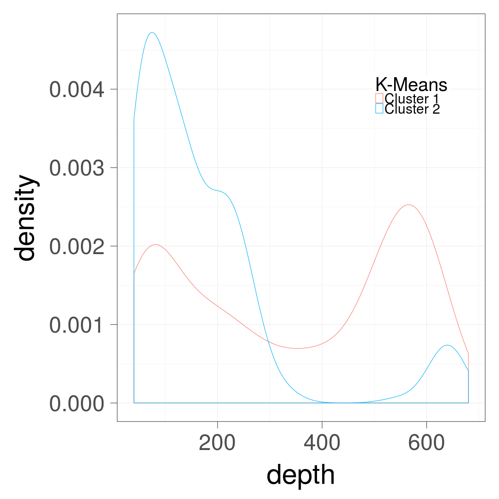
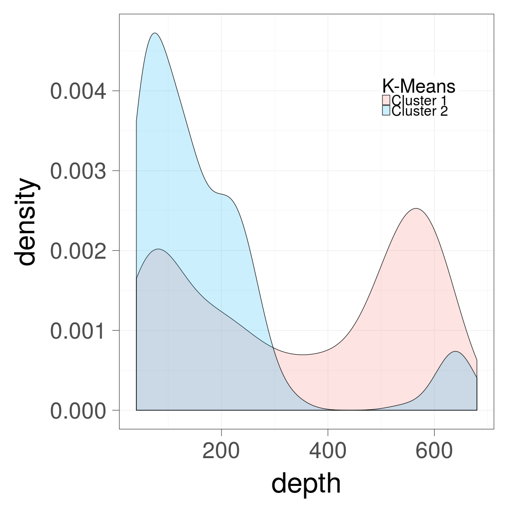
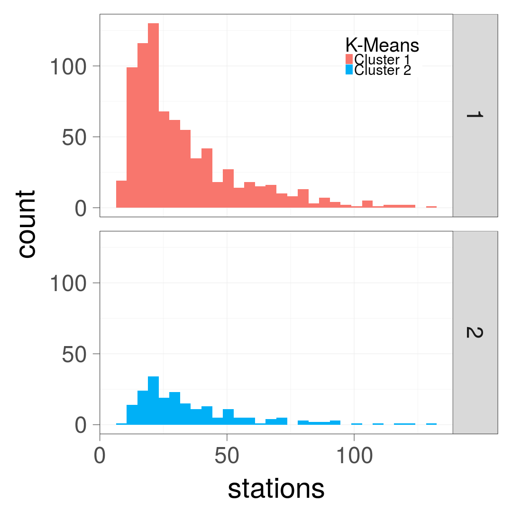
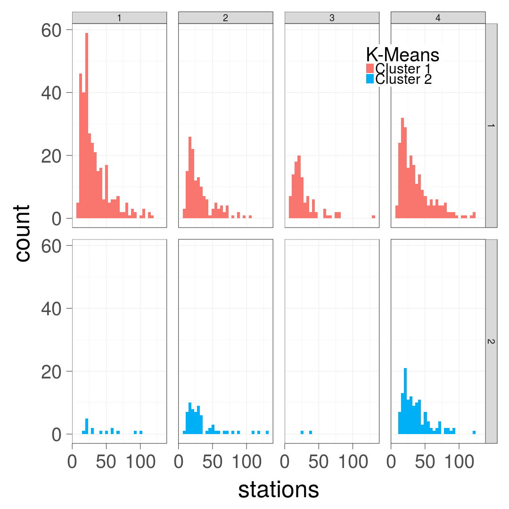

ggplot2 (for the brave and true)
========================================================
width: 1920
height: 1280
author: Daniel Moyer
date: 8/1/31
autosize: true

Presentation Objectives
========================================================

`ggplot2` is a package from [Hadley Wickham](http://hadley.nz/).

- Implements [the Grammar of Graphics](https://www.amazon.com/Grammar-Graphics-Statistics-Computing/dp/0387245448/ref=as_li_ss_tl?ie=UTF8&qid=1477928463&sr=8-1&keywords=the+grammar+of+graphics&linkCode=sl1&tag=ggplot2-20&linkId=f0130e557161b83fbe97ba0e9175c431), by Leland Wilkinson.
- Makes nice plots (...and that's what we all wanted right?)
- Related to some useful data-reshaping packages.

The Grammar of Graphics
========================================================

>"The grammar of graphics takes us beyond a limited set of charts (words) to an almost unlimited world of graphical forms (statements)." 
>
>    -Leland Wilkinson, Chapter 1, The Grammar of Graphics

<br />
- `ggplot2` is Object Oriented, with a plot object manipulated by member functions
- Corollary: Usually viewport agnostic (doesn't need a screen to make a plot!)
- It is imperfect.

Data to play with
========================================================


```r
summary(quakes)
```

```
      lat              long           depth            mag      
 Min.   :-38.59   Min.   :165.7   Min.   : 40.0   Min.   :4.00  
 1st Qu.:-23.47   1st Qu.:179.6   1st Qu.: 99.0   1st Qu.:4.30  
 Median :-20.30   Median :181.4   Median :247.0   Median :4.60  
 Mean   :-20.64   Mean   :179.5   Mean   :311.4   Mean   :4.62  
 3rd Qu.:-17.64   3rd Qu.:183.2   3rd Qu.:543.0   3rd Qu.:4.90  
 Max.   :-10.72   Max.   :188.1   Max.   :680.0   Max.   :6.40  
    stations     
 Min.   : 10.00  
 1st Qu.: 18.00  
 Median : 27.00  
 Mean   : 33.42  
 3rd Qu.: 42.00  
 Max.   :132.00  
```

Easy summary of the data (not ggplot)
========================================================
left: 40%


```r
pairs(quakes)
```

***


Adding a few columns to quakes
========================================================

```r
quakes_df <- quakes

km_output <- kmeans(quakes[,c("lat","long")], centers = 2)
quakes_df$k2 <- factor(km_output[["cluster"]])

random_labels <- sample(1:4,nrow(quakes_df), replace=TRUE)
quakes_df$rand_label <- factor(random_labels)

km_output <- kmeans(quakes[,c("lat","long","depth")], centers = 4)
quakes_df$kd <- factor(km_output[["cluster"]])
```

Scatter plots
========================================================
left: 50%


```r
#
#installing things
install.packages("ggplot2")
library(ggplot2)

#
# making a plot?
p <- ggplot(data=quakes_df)
p
```

***


Scatter plots: Aesthetics
========================================================
left: 50%


```r
#
# making a plot?
p <- ggplot(data=quakes_df,
    mapping=aes(x=lat,y=long)) # aes!
p
```

***


Scatter plots: Finally a plot! (geom_point)
========================================================
left: 50%


```r
#
# making a plot
p <- ggplot(data=quakes_df,
    mapping=aes(x=lat,y=long)) +
  geom_point() # geom!
p
```

***


Scatter plots: Messing With Text Size ("theme")
========================================================
left: 50%


```r
#
# making a plot
p <- ggplot(data=quakes_df,
    mapping=aes(x=lat,y=long)) +
  geom_point() +
  theme_grey(base_size=60) # theme!
p
```

***


Scatter plots: Color
========================================================
left: 50%


```r
#
# making a plot
p <- ggplot(data=quakes_df, # added color
    mapping=aes(x=lat, y=long, color=k2)) +
  geom_point() +
  theme_grey(base_size=60)
p
```

***


Scatter plots: Messing with the little stuff
========================================================
left: 50%


```r
p <- ggplot(data=quakes_df,
    mapping=aes(x=lat,y=long,color=k2)) +
  theme_grey(base_size=60) +
  geom_point() + 
  guides(color=guide_legend(
    title="K-Means") # title of legend
  )
p
```

***


Scatter plots: Messing with the little stuff
========================================================
left: 50%


```r
p <- p + #adding more stuff to my plot
  theme(legend.position=c(0.2,0.2),
    legend.title = element_text(size=40),
    legend.text = element_text(size=30)) +
  scale_color_manual(
    labels = c("Cluster 1", "Cluster 2"),
    values=c("#f8766d", "#00b0f6"))
p
```

***


Short review
=====
What we've got so far:

- ggplot object
- "aesthetics" specifier
- geom_point
- guides
- themes
- scales (a little)
- Plots can be code!

Let's plot something else!
=====
How about depth by these two groups?

- Currently we know about continuous x continuous point plots.
- How about plots of just one variable over its range?


Density Plots
========================================================
left: 50%


```r
p <- ggplot(data=quakes_df,
    mapping=aes(
      x=depth, # now using depth
      color=k2) # color still grouping
    ) +
  geom_density() + # density instead of point
  ...other legend stuff # same as before
p
```

***


Density Plots: BW Theme (my favorite)
========================================================
left: 50%


```r
p <- ggplot(data=quakes_df,
    mapping=aes(
      x=depth,
      color=k2)
    ) +
  theme_bw(base_size=60) + # change to bw
  geom_density() +
  ...other legend stuff
p
```

***


Density Plots: Fill vs. Color
========================================================
left: 50%


```r
p <- ggplot(data=quakes_df,
    mapping=aes(
      x=depth,
      fill=k2) # change to fill
    ) +
  theme_bw(base_size=60) +
  geom_density() +
  ...other legend stuff
p
```

***


Density Plots -- Alpha/Opacity
========================================================
left: 50%


```r
p <- ggplot(data=quakes_df,
    mapping=aes(
      x=depth,
      fill=k2)
    ) +
  theme_bw(base_size=60) +
  geom_density(alpha=0.2) + # add alpha
  ...other legend stuff
p
```

***


Facet Grid
========================================================
left: 50%


```r
p <- ggplot(data=quakes_df,
    mapping=aes(
      x=depth,
      fill=k2)
    ) +
  theme_bw(base_size=60) +
  geom_density(alpha=0.2) +
  facet_grid(k2 ~ .) + #facet grid
  ...other legend stuff
p
```

***


Discrete count data: Histogram
========================================================
left: 50%


```r
p <- ggplot(data=quakes_df,
    mapping=aes(
      x=stations,
      fill=k2)
    ) +
  geom_histogram() + # histogram!
  facet_grid(k2 ~ .) +
  ...other legend stuff
p
```

***


Two-way facet grid
========================================================
left: 50%


```r
p <- ggplot(data=quakes_df,
    mapping=aes(
      x=stations,
      fill=k2)
    ) +
  geom_histogram() +
  facet_grid(k2 ~ kd) + #two ways!
  theme(strip.text.x = element_text(
    size = 20,margin = margin(5,5,5,5))) +
  theme(strip.text.y = element_text(
    size = 20,margin = margin(5,5,5,5)))
  ...other legend stuff
p
```

***


Three labels one plot? Kinda unreadable, but maybe *you* can make it work
========================================================
left: 50%


```r
p <- ggplot(data=quakes_df,
    mapping=aes(
      x=stations,
      fill=rand_label) #third label
    ) +
  geom_histogram() +
  facet_grid(k2 ~ kd) + #two ways!
  ...other legend stuff
p
```

***


Colors, and why jet sucks
===============

Let's talk about actually doing things
===============

- Loading in data
- Scripting your plotting! (And processing)
- Other stuff?
